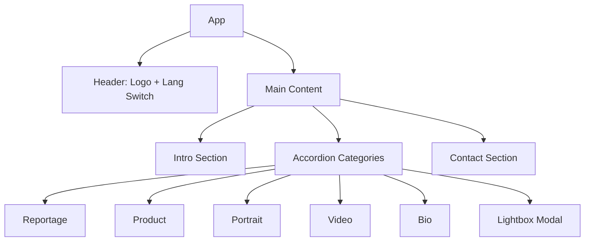

# BANENA Portfolio SPA

## Архитектура

Одностраничное приложение с аккордеон-секциями. Минимум зависимостей, кастомные компоненты.



## Стек

| Технология | Назначение |

|------------|------------|

| Next.js 14 (App Router) | Фреймворк, SSG |

| Tailwind CSS | Стилизация |

| Framer Motion | Анимации (аккордеон, лайтбокс) |

| next/image | Оптимизация изображений |

**Без внешних библиотек для:** галереи, лайтбокса, i18n, слайдера.

## Структура файлов

```
src/
├── app/
│   ├── layout.tsx          # Root layout + шрифты
│   ├── page.tsx            # Главная (SPA)
│   └── globals.css         # Tailwind + CSS variables
├── components/
│   ├── Header.tsx          # Логотип + переключатель языка
│   ├── Accordion.tsx       # Аккордеон-секция
│   ├── Gallery.tsx         # Сетка изображений
│   ├── Lightbox.tsx        # Полноэкранный просмотр + листалка
│   └── Contact.tsx         # Контакты
├── context/
│   └── LangContext.tsx     # i18n контекст
├── locales/
│   ├── ru.json             # Русские тексты
│   └── en.json             # Английские тексты
├── data/
│   └── portfolio.ts        # Данные о работах (категории, фото)
└── lib/
    └── useKeyboard.ts      # Хук для навигации клавиатурой
```

## Компоненты

### 1. Accordion

- Раскрытие/закрытие секций по клику
- Только одна секция открыта (или несколько — уточним)
- Анимация height через Framer Motion
- Состояние в URL hash для шеринга (`#reportage`)

### 2. Gallery

- CSS Grid: 3 колонки desktop, 2 tablet, 1 mobile
- Lazy loading изображений
- Hover: едва заметный scale (1.02) + opacity
- Клик открывает Lightbox

### 3. Lightbox

- Полноэкранный оверлей с затемнением
- Навигация: стрелки, свайп, клавиатура (←/→/Esc)
- Счётчик: 1/12
- Закрытие: клик вне фото, кнопка X, Esc
- Preload соседних изображений

### 4. i18n

- `LangContext` с `locale` и `t()` функцией
- Переключатель RU/EN в header
- Сохранение в localStorage
- Тексты в JSON файлах

## Дизайн

### Цвета (тёмная тема)

```css
--bg: #0a0a0a;
--text: #fafafa;
--text-muted: #71717a;
--border: #27272a;
```

### Типографика

- Шрифт: `SF Pro Display` / `system-ui` (web brutal)
- H1: 48px, light weight
- Nav items: 32px, при hover — full opacity
- Body: 16px

### Анимации (subtle)

- Аккордеон: 300ms ease-out
- Hover на фото: 200ms scale(1.02)
- Lightbox: fade 200ms
- Page load: staggered fade-in секций

## Принципы работы

**Объяснения по ходу:**

- Каждая команда — с комментарием зачем она
- Архитектурные решения — почему так, а не иначе
- Ликбез: если есть неочевидный момент — объясню
- Альтернативы: если есть другой путь — упомяну

## Этапы реализации

### Этап 1: Базовая структура

- Инициализация Next.js + Tailwind
- Layout с тёмной темой
- Header с переключателем языка
- i18n контекст + JSON файлы

### Этап 2: Аккордеон-навигация

- Компонент Accordion с анимацией
- Структура секций (Intro, Categories, Contact)
- URL hash синхронизация

### Этап 3: Галерея

- Компонент Gallery с CSS Grid
- Placeholder изображения для тестов
- Адаптивная сетка

### Этап 4: Лайтбокс

- Полноэкранный просмотр
- Навигация (клавиатура, свайп, стрелки)
- Preload и оптимизация

### Этап 5: Полировка

- Финальные анимации
- Тестирование на устройствах
- Стилистическая доводка

### Этап 6: Деплой (после утверждения)

- SEO meta-теги
- Конфиг для GitHub Pages (next.config.js: output: 'export')
- GitHub Actions для автодеплоя
- Публикация на gh-pages